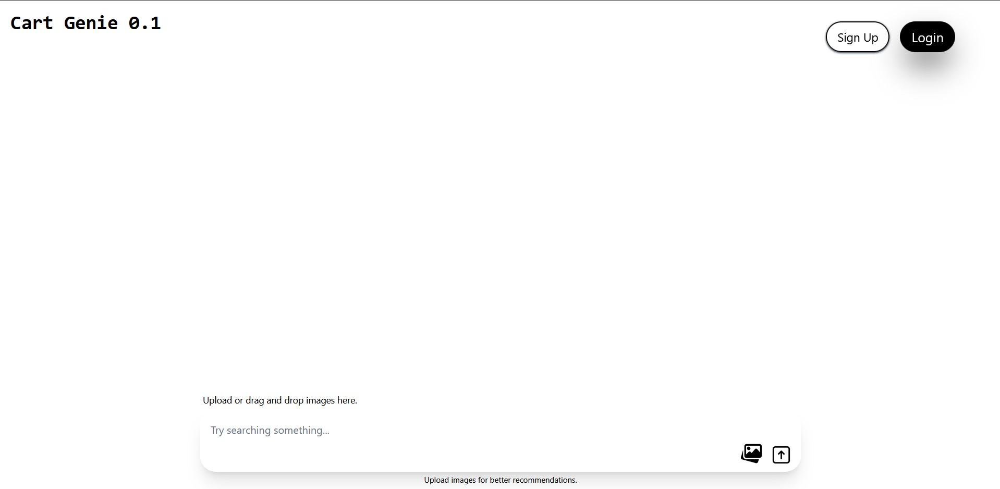
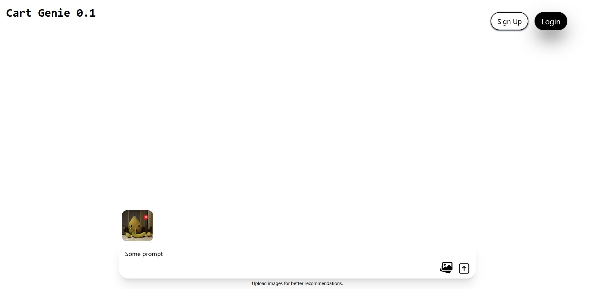

# Client
## Run
1. cd into `client` directory.
2. run `npm install` followed by `npm run dev` in the terminal
3. follow the link to open the app.

current client preview

## Cloud Databases integrated: 
1. Cloudinary for `images`
2. Supabase for `postgres`
3. Firebase for frontend auth

